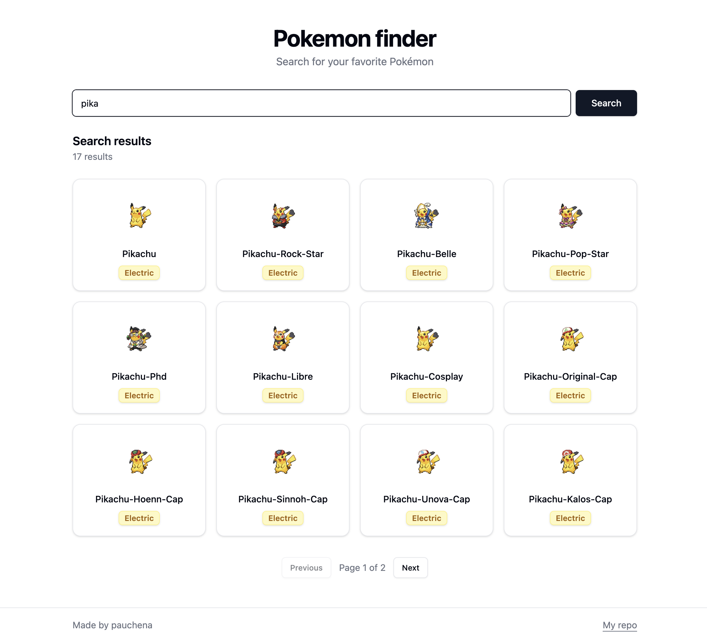

# Ixpandit PokeSearch

A search application to search for your favorite Pokémon that uses the PokeAPI as sample data.

## Preview



Features:

- Search Pokemons by partial name
- Pagination
- Basic caching with React Query and a FastAPI proxy
- Docker + docker-compose for local development

## Run locally with docker-compose:

```bash
docker-compose up --build
```

Frontend will be available at http://localhost:5173 and backend at http://localhost:8000
